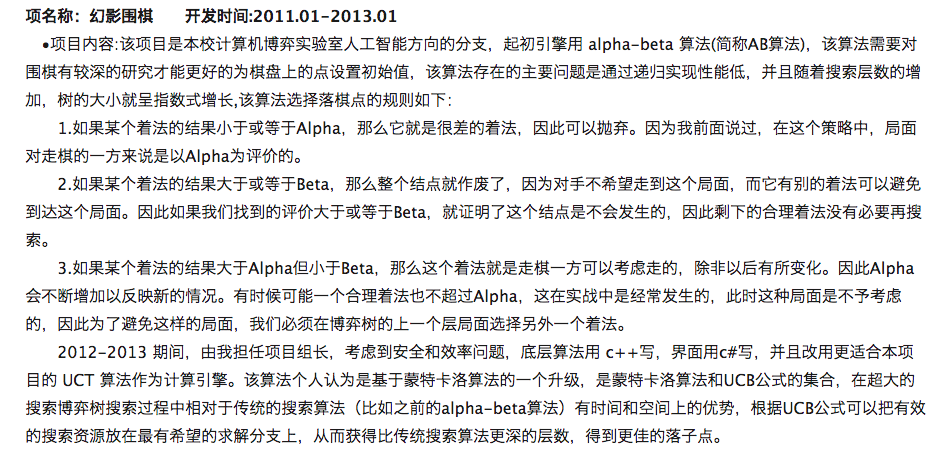

## 在校项目

### 项名称：幻影围棋   &nbsp;&nbsp;&nbsp;&nbsp;  开发时间:2011.01-2013.01

&nbsp;&nbsp;•项目内容:该项目是本校计算机博弈实验室人工智能方向的分支，起初引擎用 alpha-beta 算法(简称AB算法)，该算法需要对围棋有较深的研究才能更好的为棋盘上的点设置初始值，该算法存在的主要问题是通过递归实现性能低，并且随着搜索层数的增加，树的大小就呈指数式增长,该算法选择落棋点的规则如下：   1.如果某个着法的结果小于或等于Alpha，那么它就是很差的着法，因此可以抛弃。因为我前面说过，在这个策略中，局面对走棋的一方来说是以Alpha为评价的。   2.如果某个着法的结果大于或等于Beta，那么整个结点就作废了，因为对手不希望走到这个局面，而它有别的着法可以避免到达这个局面。因此如果我们找到的评价大于或等于Beta，就证明了这个结点是不会发生的，因此剩下的合理着法没有必要再搜索。   3.如果某个着法的结果大于Alpha但小于Beta，那么这个着法就是走棋一方可以考虑走的，除非以后有所变化。因此Alpha会不断增加以反映新的情况。有时候可能一个合理着法也不超过Alpha，这在实战中是经常发生的，此时这种局面是不予考虑的，因此为了避免这样的局面，我们必须在博弈树的上一个层局面选择另外一个着法。   2012-2013 期间，由我担任项目组长，考虑到安全和效率问题，底层算法用 c++写，界面用c#写，并且改用更适合本项目的 UCT 算法作为计算引擎。该算法个人认为是基于蒙特卡洛算法的一个升级，是蒙特卡洛算法和UCB公式的集合，在超大的搜索博弈树搜索过程中相对于传统的搜索算法（比如之前的alpha-beta算法）有时间和空间上的优势，根据UCB公式可以把有效的搜索资源放在最有希望的求解分支上，从而获得比传统搜索算法更深的层数，得到更佳的落子点。

