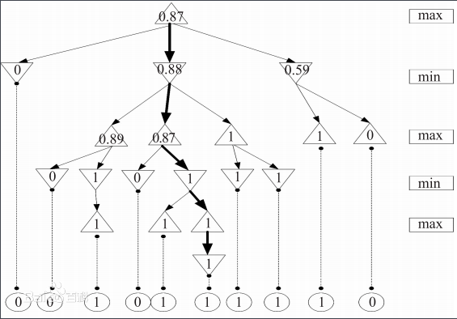

## 在校项目经验

### 项名称：幻影围棋   &nbsp;&nbsp;&nbsp;&nbsp;  开发时间:2011.01-2013.01

&nbsp;&nbsp;•项目内容:该项目是本校计算机博弈实验室人工智能方向的分支，起初引擎用 alpha-beta 算法(简称AB算法)，该算法需要对围棋有较深的研究才能更好的为棋盘上的点设置初始值，该算法存在的主要问题是通过递归实现性能低，并且随着搜索层数的增加，树的大小就呈指数式增长,该算法选择落棋点的规则如下：   1.如果某个着法的结果小于或等于Alpha，那么它就是很差的着法，因此可以抛弃。因为我前面说过，在这个策略中，局面对走棋的一方来说是以Alpha为评价的。   2.如果某个着法的结果大于或等于Beta，那么整个结点就作废了，因为对手不希望走到这个局面，而它有别的着法可以避免到达这个局面。因此如果我们找到的评价大于或等于Beta，就证明了这个结点是不会发生的，因此剩下的合理着法没有必要再搜索。   3.如果某个着法的结果大于Alpha但小于Beta，那么这个着法就是走棋一方可以考虑走的，除非以后有所变化。因此Alpha会不断增加以反映新的情况。有时候可能一个合理着法也不超过Alpha，这在实战中是经常发生的，此时这种局面是不予考虑的，因此为了避免这样的局面，我们必须在博弈树的上一个层局面选择另外一个着法。   2012-2013 期间，由我担任项目组长，考虑到安全和效率问题，底层算法用 c++写，界面用c#写，并且改用更适合本项目的 UCT 算法作为计算引擎。该算法个人认为是基于蒙特卡洛算法的一个升级，是蒙特卡洛算法和UCB公式的集合，在超大的搜索博弈树搜索过程中相对于传统的搜索算法（比如之前的alpha-beta算法）有时间和空间上的优势，根据UCB公式可以把有效的搜索资源放在最有希望的求解分支上，从而获得比传统搜索算法更深的层数，得到更佳的落子点。

•项目结果:取得2013年全国大学生计算机博弈熔盛杯幻影围棋组一等奖。

## 企业项目经验
### 项名称：政策抓取系统   &nbsp;&nbsp;&nbsp;&nbsp;  开发时间:2014.12-2016.01
  •项目内容:主要负责所有的正向政策，变更政策，遗漏政策抓取。这一套系统涉及到爬虫策略，比如通过控制访问频率，走代理等IP来防止被封账号，为了保证网页数据抓取的稳定性由此也衍生出了VPN系统以及基于BP神经网络算法的验证码识别系统,并且通过Redis实现登录信息单点锁，实现cookie复用;简单的移动端通过Fillder设置代理抓取数据，复杂移动端数据由于加壳，可以通过Android的辅助功能进行数据抓取
  •项目结果如下:
    本人研究破解的部分1,2代验证码：
    

### 项名称：基于大数据和商业智能业务运营系统   &nbsp;&nbsp;&nbsp;&nbsp;  开发时间:2016.02-2017.02
  •项目内容:该系统最初采用Kettle进行数据处理,针对小数据量勉强可以接受；随着数据量增加后改为采用基于CDH搭建的大数据平台，通过Hive或者spark sql 处理各个业务线的数据，最后通过自主开发的基于模版配置的运营系统进行展示，目前业务涉及到HDFS、Hive、Kafka、Sqoop等工具，因为目前涉及到的业务基本上都是离线数据，通过hive以及udf函数完全满足报表的处理。
  •项目结果:2小时内处理完公司所有的报表。
### 项名称：基于elasticsearch的服务性能分析系统   &nbsp;&nbsp;&nbsp;&nbsp;  开发时间:2017.02-2017.03
  •项目内容:该系统主要是利用日志归集程序把ACC日志归集到elasticsearch集群，然后外挂通过elasticsearch的Resultful接口定时统计某个时间段的各个服务的调用耗时，最后邮件通知到不达标的各业务线负责人,由于当时我对elasticsearch使用经验不足，不敢上太多服务器，于是在内网找了3台PC服务器搭建了一个简单的集群，并且
  •项目结果:近实时监控各服务的性能情况。

### 项名称：运维自动发布系统   &nbsp;&nbsp;&nbsp;&nbsp;  开发时间:2017.04-2017.10
  •项目内容:该系统是利用Jenkins框架搭建了一套基于SVN版本库的自动打包系统（代码规范和质量通过Sonar来保证），打好的包扔到指定的设备服务器上，然后通过搭建的发布系统进行发布，发布系统的原理大致是windows server系统通过WMI进行操作，Linux则通过SSH协议进行操作。
  •项目结果:通过该系统节约了开发、运维人员的30%的时间。
### 项名称：用户画像   &nbsp;&nbsp;&nbsp;&nbsp;  开发时间:2017.10-2018.02
  为了路由器可以精确的向用户推送广告，需根据用户上网情况进行用户画像。我主要针对用户访问的URL进行匹配，比如你访问了汽车之家，那么我需要维护起汽车之家这个词与URL的对应关系（爬虫实现），采用Hive进行存储，然后采用SparkSql对数据清洗，比如统计出某个用户当天访问汽车之家的次数，根据次数给用户打上汽车迷之类的标签。
	项目结果:用户广告点击率提升20%左右。

### 项名称：风控Hive数据仓库   &nbsp;&nbsp;&nbsp;&nbsp;  开发时间:2018.03-至今
  为了实现数据治理，快速出应用表，方便模型回溯，经调研确定了数仓项目。整个数仓主要分为四层:ods、dwb、dws、ads,采用Sqoop按照T+1模式把Mysql数据同步到ods层,采用HQL进行清洗生成dwb明细层，接着生成dws维度表/汇总表，dws偏向于应用,类似于ads，ads即用户最终所需表。各表之间的依赖通过依赖配置表来实现，为了方便其他组提交任务到数仓，还搭建了一个任务提交平台，该平台可以自动解析任务依赖，提供试跑，优先级设置，审核等功能。
	项目结果:为模型清洗特征效率提升25%，一天内出报表，加强了数据管控。

